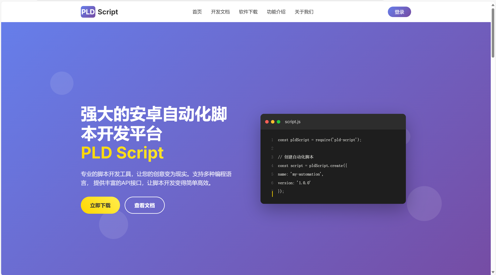

# PLD Script 官网前端

## 项目介绍

PLD Script 是一个强大的安卓自动化脚本开发平台，为开发者和企业提供专业、易用的脚本开发工具。



## 功能特性

- 🚀 **强大的脚本开发平台** - 支持多种编程语言，提供丰富的API接口
- 📱 **安卓自动化** - 专业的安卓自动化脚本开发工具
- 💻 **现代化界面** - 美观的用户界面和流畅的用户体验
- 📚 **完整文档** - 详细的开发文档和API参考
- 🔧 **多平台支持** - 支持Windows、macOS、Linux等操作系统
- 🛡️ **安全可靠** - 内置安全机制，保护代码和数据安全

## 技术栈

- **前端框架**: Vue 3 + Composition API
- **构建工具**: Vite
- **样式**: CSS3 + 响应式设计
- **图标**: FontAwesome
- **字体**: Google Fonts (Inter)

## 联系方式

- 📧 **邮箱**: 15223303170@163.com
- 📞 **电话**: 15223303170
- 💬 **微信**: PLDScript
- ⏰ **服务时间**: 24小时在线服务

## 快速开始

### 安装依赖

```bash
npm install
```

### 启动开发服务器

```bash
npm run dev
```

### 构建生产版本

```bash
npm run build
```

### 预览生产版本

```bash
npm run preview
```

## 项目结构

```
src/
├── components/
│   └── Home.vue          # 主页面组件
├── App.vue               # 根组件
├── main.js              # 入口文件
└── style.css            # 全局样式
```

## 页面功能

- 🏠 **首页** - 产品介绍和主要功能展示
- 📖 **开发文档** - 快速开始、API参考、教程指南
- 💾 **软件下载** - 多平台版本下载
- ⚡ **功能介绍** - 核心功能详细说明
- 👥 **关于我们** - 团队介绍和联系方式
- 🔐 **用户登录** - 用户认证和个人中心

## 开发说明

这是一个基于Vue 3的单页面应用，采用现代化的前端开发技术栈。页面设计注重用户体验，包含丰富的动画效果和响应式布局。

## 许可证

© 2024 PLD Script. 保留所有权利。
